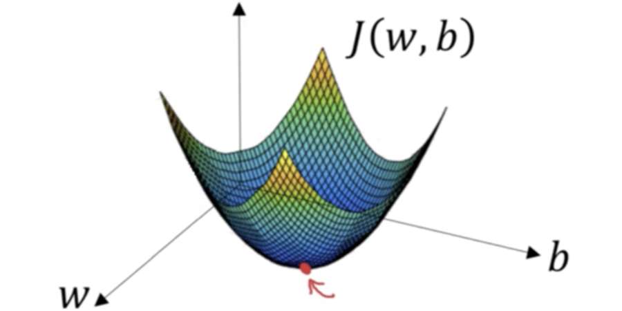

[강의영상](https://www.youtube.com/watch?v=uJryes5Vk1o&list=PLkDaE6sCZn6Ec-XTbcX1uRg2_u4xOEky0&index=11&t=9s)

# Gradient Descent

### logistic regression

$$ \hat{y}=\sigma(w^Yx+b), \sigma(z)=\frac{1}{1+e^{-z}} $$

### 매개변수 $w,b$에 대한 cost function $J$

이 cost function $J$는 loss function $L$의 평균값이기도 함.
$$ J(w,b)=\frac{1}{m}\sum_{i=1}^m L(\hat{y}_i,y_i)=-\frac{1}{m}\sum_{i=1}^m y_i\log \hat{y}_i+(1-y_i)\log (1-\hat{y}_i)$$
매개변수 $w,b$를 찾기 위해서는 cost function $J(w,b)$를 가장 작게 만드는 $w,b$를 찾아야 한다.

위 그림에서 두 가로축은 매개변수 $w,b$이다. cost function은 곡면 $J(w,b)$ 이고, 곡면의 높이는 $J(w,b)$값이다.여기서 $J$값의 최소값. 즉, 아래로 볼록한 부분을 찾는 것이 우리의 목표이다.

이런 간단한 모양의 $J$가 있다고 가정해보자.  
Gradient Descent는 이런 수식을 반복한다.
$$ Repeat[w:=w-\alpha \frac{dJ(w)}{dw}]$$

- 이 수식에서 $:=$는 갱신된다는 뜻이다
- $alpha$는 학습률(learning rate)이고 Gradient Descent를 할 때 한 단계의 크기를 결정한다.
- $\frac{dJ(w)}{dw}$는 미분계수로, 갱신 시 매개변수$w$에 줄 변화를 나타낸다.
  - Gradient Descent를 구현 할 때는 관습적으로 코드에 이 미분계수의 변수 이름을 $dw$라 정한다.
  - 따라서 이렇게 쓰게 된다. $w:=w-\alpha dw$
  - 미분계수$dw$는 함수의 기울기라 할 수 있다.

### How to Use Gradient Descent

바로 위의 함수와 수식을 예로 들어보자.

1. $w$가 점 1의 위치에 있다면 기울기가 음수이고, 따라서 미분계수 $dw$가 음수가 되므로 $-\alpha dw$는 양수가 되어 $w$가 증가한다.
2. $w$가 점 2의 위치에 있다면 기울기가 양수이고, 따라서 미분계수 $dw$가 양수가 되므로 $-\alpha dw$는 음수가 되어 $w$가 감소한다.

1,2의 과정을 반복하며 최소값에 도달하게 한다.

$J(w,b)$도 이와 비슷한 방법으로 풀 수 있다.
$$ w:=w-\alpha \frac{dJ(w,b)}{dw}$$
$$ b:=b-\alpha \frac{dJ(w,b)}{db}$$

- $J$가 두 개 이상의 변수를 가진 함수라면 $d$대신 편미분기호$\partial$를 쓸 때도 있다.
- 따라서 위 미분계수의 정확한 표기는$\frac{\partial J(w,b)}{\partial w}$ 이다.
- 위 함수에서 $w$의 변화량을 나타내는 미분계수 $\frac{dJ(w,b)}{dw}$는 $dw$로 표현하고
- $b$의 변화량을 나타내는 미분계수 $\frac{dJ(w,b)}{db}$는 $db$로 표현한다.

> C1W2L05~06은 미적분에 관한 내용이므로 생략한다.
